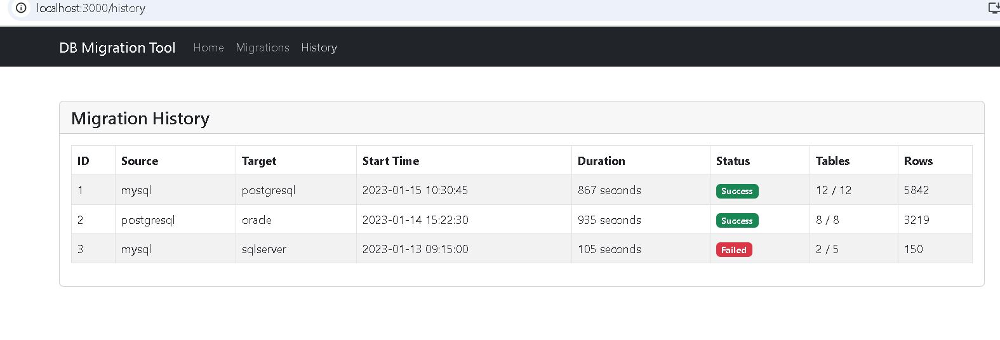

# Enterprise Database Migration Tool

A comprehensive tool for migrating data between different database systems with advanced features like schema translation, data validation, performance optimization, and comprehensive logging.

# DB Migration Tool

## Screenshots

### Home View

### Database Migration View

### History View

## Features

- **Multi-Database Support**: Migrate between MySQL, PostgreSQL, Oracle DB, and SQL Server
- **Schema Translation**: Automatic mapping of data types between different database systems
- **Data Validation**: Ensure data integrity during migration
- **Performance Optimization**: Batch processing and parallel execution for large datasets
- **Comprehensive Logging**: Detailed migration reports and audit trails
- **User-Friendly Interface**: Web dashboard for monitoring migrations
- **RESTful API**: Programmatic access for integration with other systems
- **Cloud Provider Integrations**: Support for AWS RDS, Azure SQL, and Oracle Cloud

## Technology Stack

- Java & Spring Boot
- React for frontend
- MongoDB, PostgreSQL, Oracle DB, SQL Server
- Docker & Docker Compose
- JUnit & Mockito for testing

## Getting Started

### Prerequisites

- Docker and Docker Compose
- JDK 11 or later
- Maven
- Node.js and npm (for frontend development)

### Setup

1. Clone the repository:

git clone (https://github.com/Asif12as/EnterpriseDBMigrator_Tool.git)
cd EnterpriseDBMigrator_Tool

2. Build the backend:

mvn clean package
3. Build the frontend:
cd frontend
npm install
npm run build
4. Run the application using Docker Compose: docker-compose up --build

5. Access the application at http://localhost:8080

## API Documentation

### Migration API

#### Start a migration

POST /api/migrations
Content-Type: application/json

{
"sourceType": "mysql",
"sourceHost": "localhost",
"sourcePort": 3306,
"sourceDatabase": "source_db",
"sourceSchema": "public",
"sourceUsername": "root",
"sourcePassword": "password",
"targetType": "postgresql",
"targetHost": "localhost",
"targetPort": 5432,
"targetDatabase": "target_db",
"targetSchema": "public",
"targetUsername": "postgres",
"targetPassword": "password",
"includeData": true,
"batchSize": 1000,
"validateData": true
}

#### Get supported databases

GET /api/migrations/supported-databases

## Architecture

This application follows a layered architecture:

- **Presentation Layer**: REST controllers and React frontend
- **Service Layer**: Core migration logic and business rules
- **Data Access Layer**: Connection management and database operations

## Contributing

1. Fork the repository
2. Create your feature branch (`git checkout -b feature/amazing-feature`)
3. Commit your changes (`git commit -m 'Add some amazing feature'`)
4. Push to the branch (`git push origin feature/amazing-feature`)
5. Open a Pull Request

## License

This project is licensed under the MIT License - see the LICENSE file for details.
